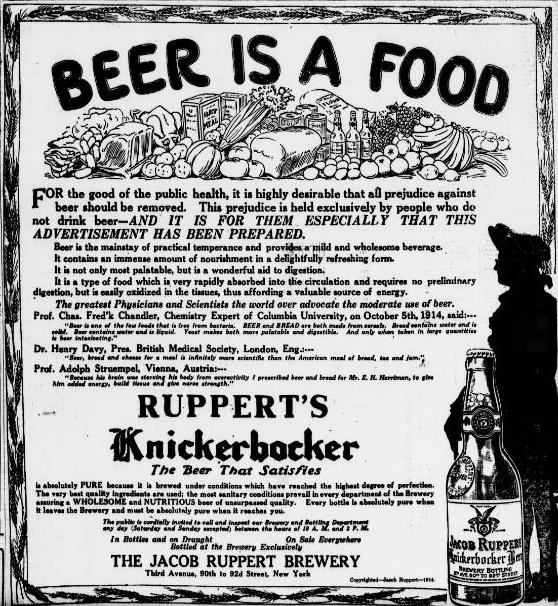

Here is an image of the ad:

BEER IS A FOOD

FOR the good of the public health, it is highly desirable that all predjudice against beer should be removed. This prejudice is held exclusively by people who do not drink beer -- AND IT IS FOR THEM ESPECIALLY THAT THIS ADVERTISEMENT HAS BEEN PREPARED.

Beer is the mainstay of practical temperance and provides a mild and wholesome beverage.
It contains an immense amount of nourishment in a delightfully refreshing form. 
It is not only most palatable, but is a wonderful aid to digestion. 
It is a type of food which is very rapidly absorbed into the circulation and requires no preliminary digestion, but is easily oxidized in the tissues, thus affording a valuable source of energy. 

The greatest Physicians and Scientists the world over advocate the moderate use of beer. 
Prof. Chas. Fred'k Chandler, Chemistry Expert of Columbia University, on Octber 5th, 1914, said...
"Beer is one of the few foods that is free from bacteria. BEER and BREAD are both made from. Bread contains water and is solid. Beer contains water and is liquid. Yeast makes both more palatable and digestable. And only when taken in large quantities is beer intoxicating. 
Dr. Henry Davy, Pres. British Medical Society, London, Eng:...
"Beer, bread, and cheese for a meal is infinitely more scientific than the American meal of bread, tea, and jam."

Prof. Aldolph Struempel, Vienna, Austria:...
"Because his brain was starving his body from ? I prescribed beer and bread for Mr. E. H. Harrbman, to give him added energy, build tissue and give more strength. "

RUPPERT'S

KNICKERBOCKER 
The Beer That Satisfies 

Is absolutely PURE because it is brewed under conditions which have reached the highest degree of perfection. The very best quality ingredients are used; the most sanitary conditions prevail in every department of the Brewery assuring a WHOLESOME and NUTRITIOUS beer of unsurpassed quality. Every bottle is absolutely pure when it leaves the Brewery and must be absolutely pure when it reaches you. 

The public is cordially invited to call and inquest our Brewery and Bottling Department any day (Saturday and Sunday excepted) between the hours of 10 A.M. and 1 P.M.

In Bottles and on Draught                   On Sale Everywhere
Bottled at the Brewery Exclusively

THE JACOB RUPPERT BREWERY 
Third Avenue, 90th to 92nd Street, New York 
